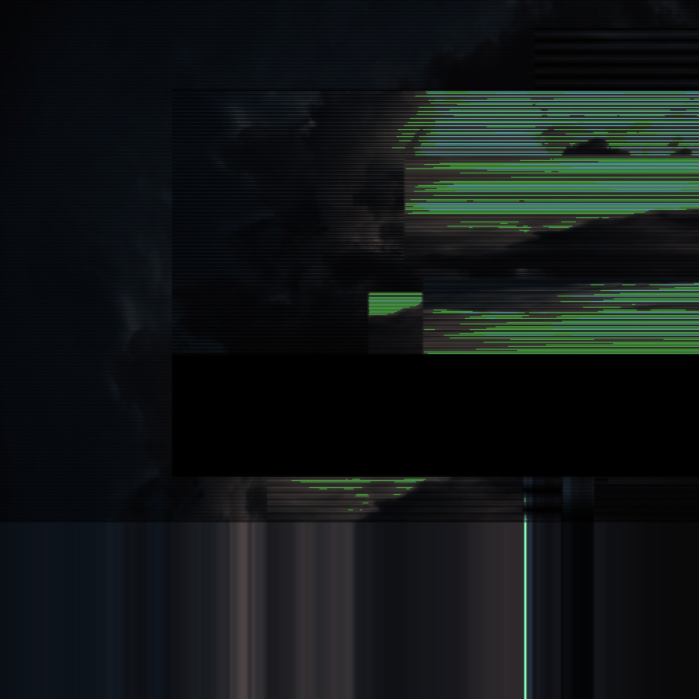

# Glitch-FX-Processing-Version
A Processing version of my Glitch-FX sketch with extra features
  
 

<h2>About</h2>

  This is a version of my Glitch-FX sketch on Open Processing done fully with original (Java) Processing 3.
    
  This version also comes with the ability to load your own images as well as saving your own creations!

<h2>Instructions</h2>
<ul>
  <li>Press <b>'G'</b> to generate a new effect on the image.</li>
  <li>Press <b>'J'</b> to save as .jpg (NOTE: when saving just type a file name <b>without</b> the extension)</li>
  <li>Press <b>'P'</b> to save as .png (same note as before)</li>
  <li>Press <b>'X'</b> to exit</li>
</ul>
<h2>Effects Included</h2>
<ul>
  <li>Scramble</li>
  <li>Scanlines</li>
  <li>Warp</li>
  <li>Pixel Burn</li>
  <li>Noisy</li>
  <li>Scanner</li>
  <li>Jpg Degrade</li>
  <li>Invert Saturation</li>
  <li>OpenCV - Edge Detect</li>
  <li><b>More will be planned in the very near future</b></li>
</ul>
<h2>Future Development</h2>

<strike>As of the latest version, any image will only be loaded as a <b>fixed 1000 x 1000px size</b>. I may try to find some method of allowing variable sizes/aspect ratios depending on the input image (with the settings() function), but for now, the size remains fixed.</strike>

<h2>September 2019 Update</h2>
<ul>
<li><b>Different aspect ratios can now be loaded without forcing the source to a 1:1 square!</b> The image will be scaled down but the aspect ratio will remain as is.</li>
  <li>OpenCV library added for use of the edge detection filters.</li>
  <li>Invert Saturation filter added.</li>
</ul>
